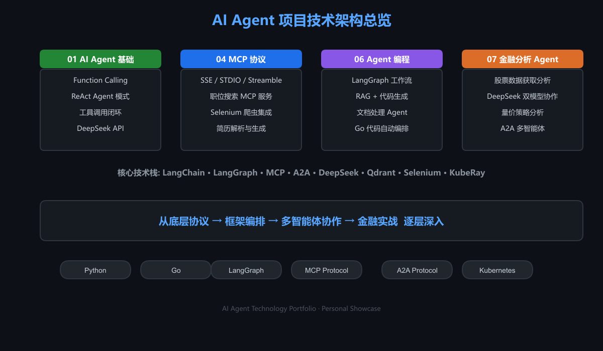
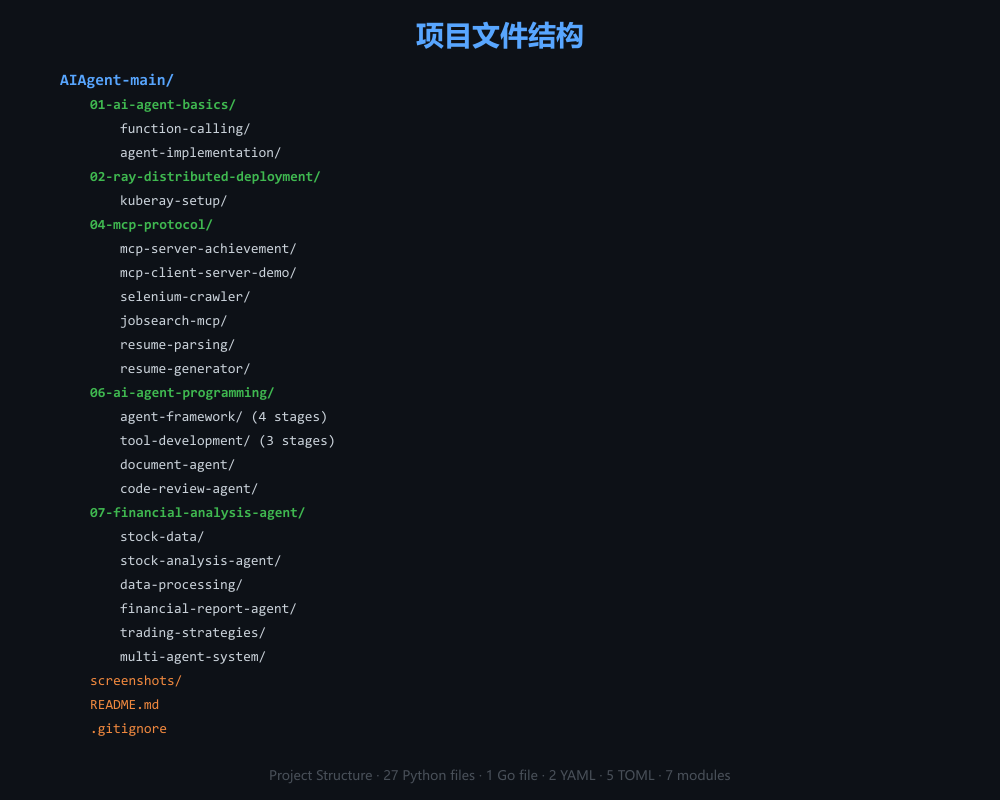
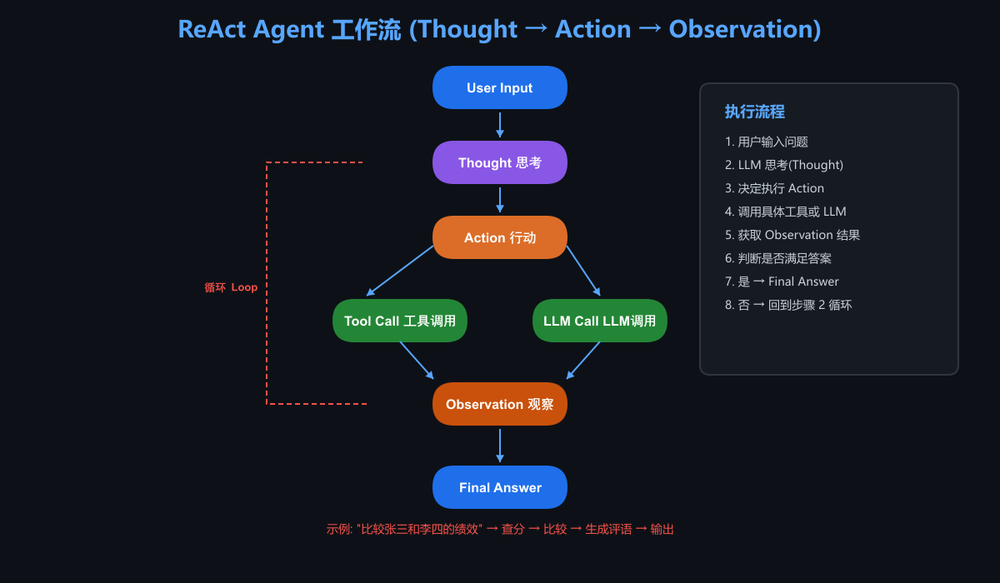
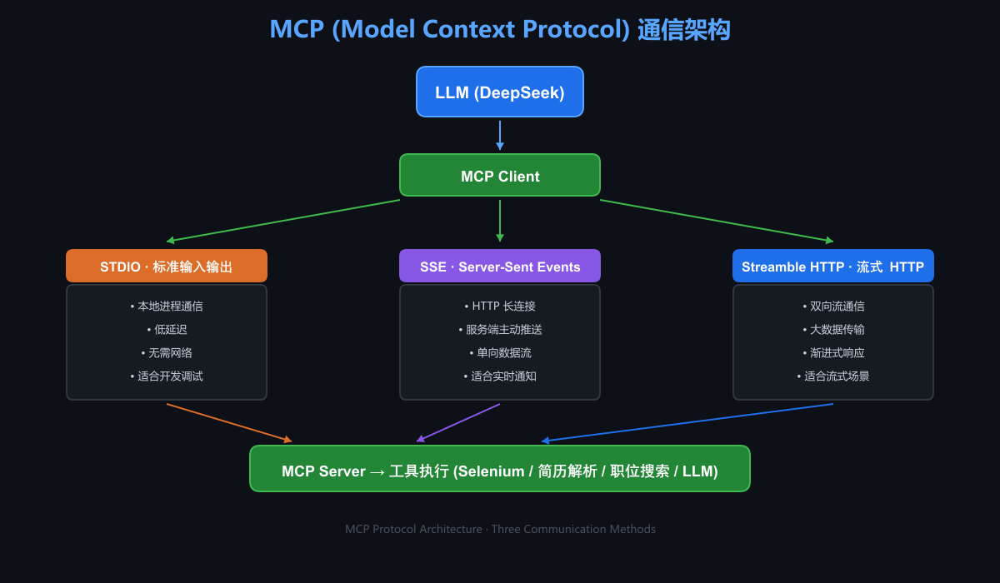
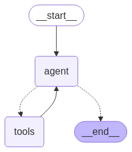
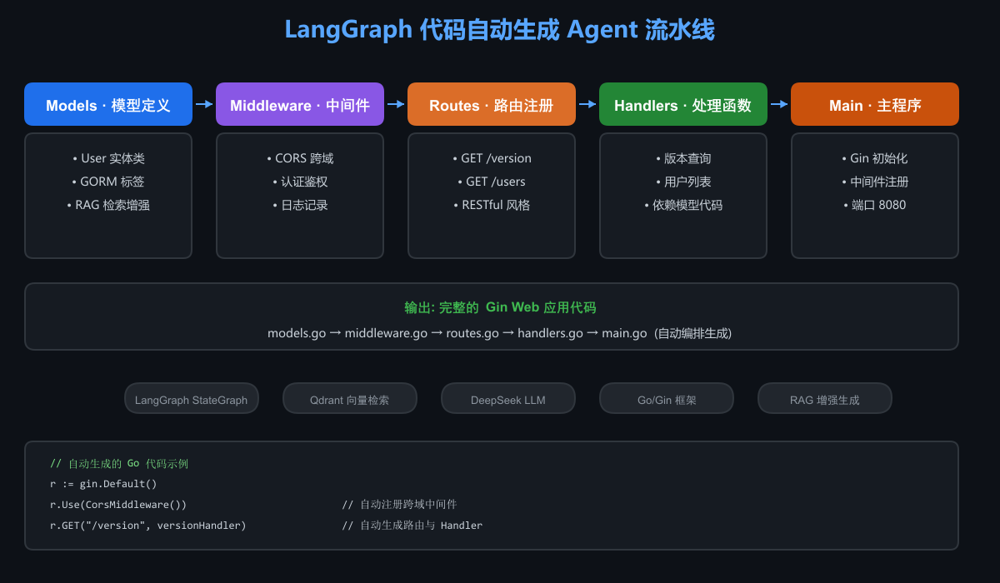
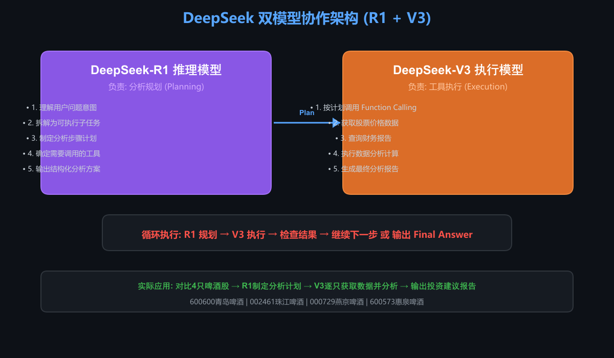
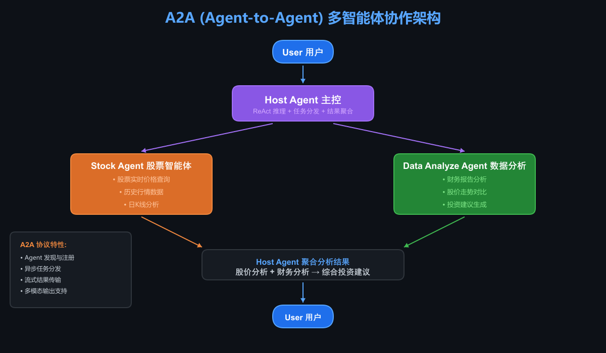
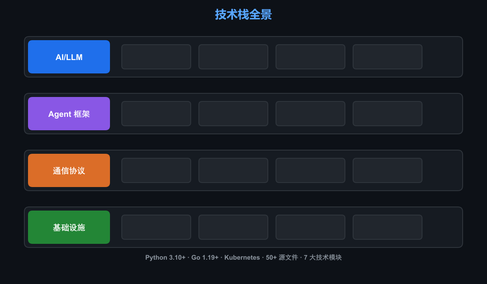

# 🤖 AI Agent 技术能力展示

> 个人 AI Agent 技术实践项目，涵盖 Function Calling、MCP 协议、LangGraph 工作流、A2A 多智能体协作及金融分析等前沿 AI 技术。

---

## 📖 关于本项目

这是我在 AI Agent 领域的技术探索与实践成果汇总。项目从底层协议到上层应用，系统性地展示了以下能力：

- 大模型 Function Calling 与 ReAct Agent 模式
- MCP（Model Context Protocol）协议的完整实现
- LangGraph 状态图驱动的 Agent 工作流编排
- A2A（Agent-to-Agent）多智能体分布式协作
- 基于 RAG 的代码自动生成
- 金融数据分析 Agent 实战

## 🏗️ 架构总览



## 🗂️ 项目结构



## 🔥 技术亮点

### 1. ReAct Agent 模式

基于 Thought → Action → Observation 循环，实现 LLM 自主推理与工具调用的完整闭环。



```python
# ReAct Prompt 驱动 Agent 自主决策
REACT_PROMPT = """
You run in a loop of Thought, Action, Action Input, PAUSE, Observation.
At the end of the loop you output an Answer.
...
"""
```

### 2. MCP 协议实现

实现了 Anthropic MCP 协议的全部三种通信方式（STDIO / SSE / Streamble HTTP），并基于 MCP 构建了完整的**职位搜索 Agent 系统**，集成 LLM 推理 + Selenium 爬虫 + 简历解析 + Word 文档生成。



### 3. LangGraph 工作流编排

使用 LangGraph StateGraph 构建多节点 Agent 流水线：



> LangGraph 生成的股票分析 Agent 状态图工作流

### 4. RAG + 代码自动生成

基于 Qdrant 向量数据库 + LangChain RAG，实现 Go 代码的智能生成。Agent 自动编排 **模型定义 → 中间件 → 路由 → Handler → main.go** 的完整代码生成流水线。



### 5. DeepSeek 双模型协作

在金融分析场景中，使用 **DeepSeek-R1** 做推理规划 + **DeepSeek-V3** 做工具执行，实现复杂分析任务的智能拆解与执行。



### 6. A2A 多智能体协作

基于 Google A2A 协议，实现 Host Agent 调度多个远程 Agent（Stock Agent + Data Analyze Agent）协同工作，完成股票分析、财报解读、投资建议的综合输出。



## 🛠️ 技术栈全景



## 📦 快速开始

```bash
# 安装核心依赖
pip install openai langchain langgraph mcp python-docx pandas akshare

# 安装 A2A 多智能体依赖
pip install a2a

# 安装 Ray 分布式依赖（可选）
pip install ray
```

### 环境变量

```bash
export DeepSeek="your-deepseek-api-key"
export AliDeep="your-qwen-api-key"
```

## 📄 License

MIT License

---

⭐ 如果这些工作对你有启发，欢迎 Star！
